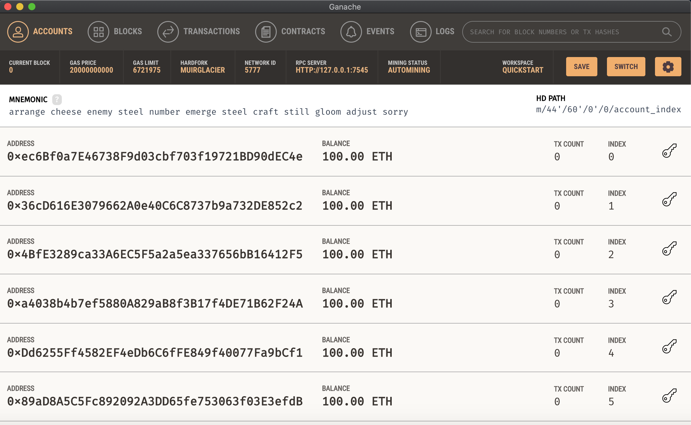
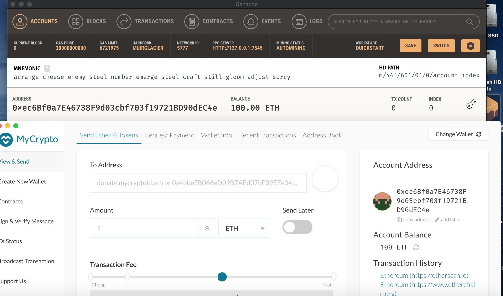
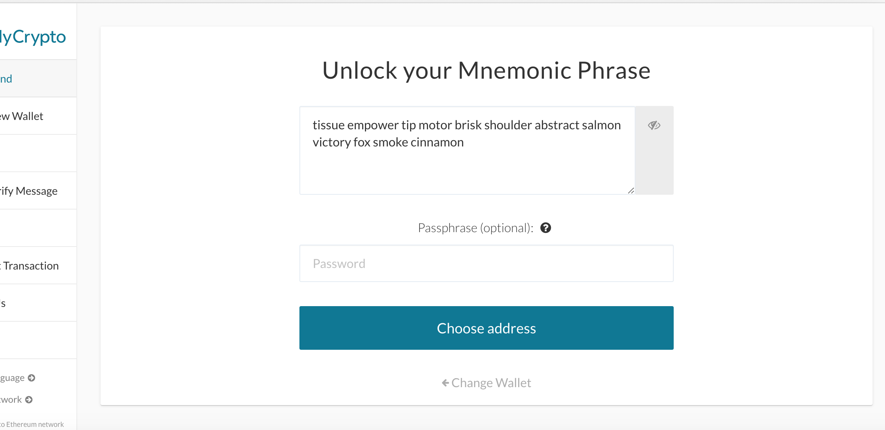
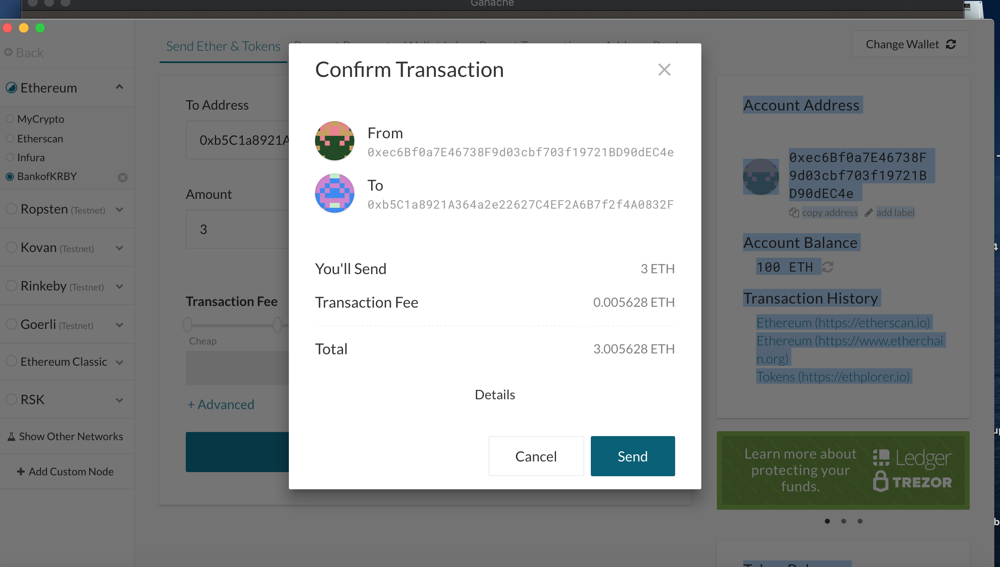
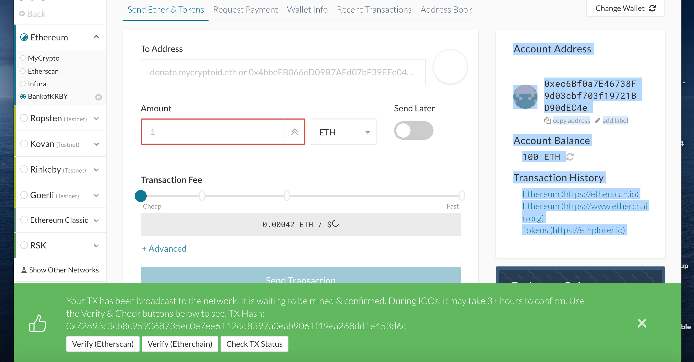
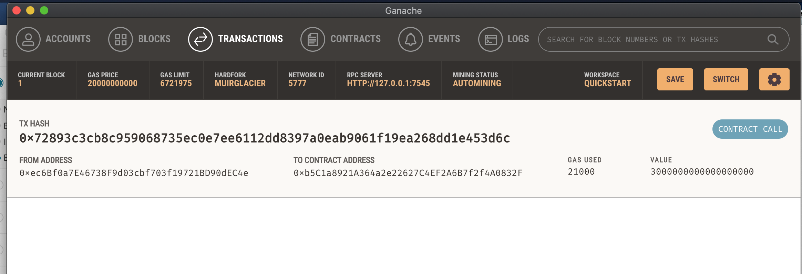

# BANKOFKRBY

### Set up a testnet or a test blockchain.

### Confirm the public addressess match.

### Unlock your account using your mnemonic phrase.

### Input the address of the recieving account. Check the address to confirm it is correct.

### Double check the addresses, amount, ect. and click 'confirm' to send the transaction.

### A push notification will come up when the network has proccessed the transaction.

### Check the transaction record to confirm the transaction successfully completed.

